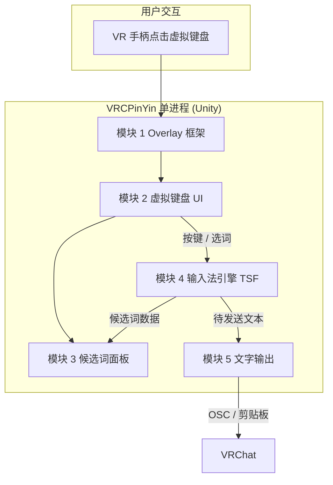

# VRCPinYin 架构文档

> 本文档专注于**框架**说明。项目背景、特性、工作流程、技术栈、项目结构等见 [README.md](../README.md)。

---

## 目录

1. [框架总览](#1-框架总览)
2. [组件与模块关系](#2-组件与模块关系)
3. [模块划分与依赖](#3-模块划分与依赖)
4. [数据流](#4-数据流)
5. [开发路线图](#5-开发路线图)
6. [附录](#6-附录)

---

## 1. 框架总览

- **单进程**：一个 Unity 应用，内含 Overlay、输入法（TSF）、文字输出；与 VRChat 仅通过 OSC 或剪贴板交互。
- **部署**：用户 PC 上运行 SteamVR，其中运行 VRChat 与 VRCPinYin；VR 头显显示画面并接收手柄输入。

组件关系见下一节；设计理由（为何 Overlay、为何单 exe、为何 TSF 等）见 [DECISIONS.md](./DECISIONS.md)。

---

## 2. 组件与模块关系

### 2.1 进程内组件关系

使用 Mermaid 流程图；若不渲染，可当作文本结构参考。



### 2.2 部署视角

```
用户 PC (Windows)
├── SteamVR
│   ├── VRChat (游戏)     ◄─── OSC :9000 / 剪贴板
│   └── VRCPinYin (单 exe)     Overlay + IME + 输出
└── VR 头显                   显示画面、手柄输入
```

---

## 3. 模块划分与依赖

### 3.1 总览与文档

| # | 模块名称 | 职责 | 文档 |
|---|----------|------|------|
| 1 | Overlay 框架 | SteamVR Overlay 初始化、显示/隐藏、快捷键、位置与渲染 | [1_overlay-framework.md](./models/1_overlay-framework.md) |
| 2 | 虚拟键盘 UI | 键盘布局、射线点击、按键事件、视觉反馈；按键/选词交给模块 4 | [2_keyboard-ui.md](./models/2_keyboard-ui.md) |
| 3 | 候选词面板 | 显示候选词、选择、翻页、高亮、当前拼音 | [3_candidates-panel.md](./models/3_candidates-panel.md) |
| 4 | 输入法引擎 | 进程内调用 Windows TSF，拼音→候选词、组句状态 | [4_ime-engine.md](./models/4_ime-engine.md) |
| 5 | 文字输出 | OSC（OscCore）/ 剪贴板 + Ctrl+V，模式切换 | [5_text-output.md](./models/5_text-output.md) |

### 3.2 依赖关系

```
           模块 1 (Overlay 框架)
                    │
           ┌───────┴───────┐
           ▼               ▼
     模块 2 (键盘)    模块 3 (候选词)
           │               ▲
           └───────┬───────┘
                   ▼
           模块 4 (输入法 TSF)
                   │
                   ▼
           模块 5 (文字输出)
```

### 3.3 代码产出目录（约定）

- 模块 1 → `Assets/Scripts/Overlay/`
- 模块 2 → `Assets/Scripts/Keyboard/`
- 模块 3 → `Assets/Scripts/Candidates/`
- 模块 4 → `Assets/Scripts/IME/`
- 模块 5 → `Assets/Scripts/Output/`

---

## 4. 数据流

### 4.1 从按键到 VRChat 的流程

```
快捷键 → 模块 1 显示 Overlay
   →
用户点键 (模块 2) → 模块 4 更新拼音并查候选
   →
模块 4 提供候选 → 模块 3 展示
   →
用户选词 (模块 3) → 模块 4 记录，组成待发送文本
   →
用户发送 → 模块 5 按模式输出（OSC 或 剪贴板）→ VRChat

（可选）点击 🎙️ → 语音转文字 → 结果填入输入框（P3 功能）
```

### 4.2 状态（进程内协同）

输入状态由模块 2/3/4 协同维护：**空闲 → 输入中 → 已选词 → 发送/取消 → 空闲**。

---

## 5. 开发路线图

| 阶段 | 目标 | 涉及模块 |
|------|------|----------|
| 阶段 0 | 文档与 UI 原型 | 全部（models/ 1–5） |
| 阶段 1 | Overlay + 键盘 + 候选词壳（可 mock 数据） | 1, 2, 3 |
| 阶段 2 | 输入法集成（TSF） | 4 |
| 阶段 3 | 输出层（OSC + 剪贴板） | 5 |
| 阶段 4 | 集成测试与发布 | 全部 |

---

## 6. 附录

### 术语表

| 术语 | 说明 |
|------|------|
| OSC | VRChat 与外部程序通信的协议，本项目中用于向聊天框发送文字 |
| Overlay | SteamVR 叠加层，可浮在游戏画面上 |
| TSF | Windows 文本服务框架，本项目中用于在进程内调用系统输入法 |
| IME | 输入法编辑器 |

### 参考资料

- [VRChat OSC](https://docs.vrczh.org/docs.vrchat.com/docs/osc-overview)
- [SteamVR Unity Plugin](https://github.com/ValveSoftware/steamvr_unity_plugin)
- [Windows TSF](https://docs.microsoft.com/en-us/windows/win32/tsf/text-services-framework)
- [OscCore](https://github.com/vrchat/OscCore)
